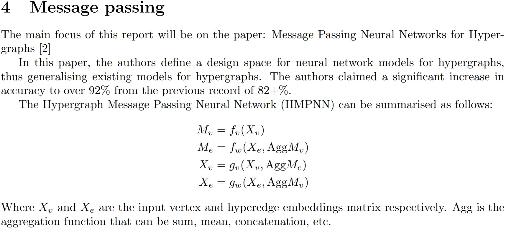
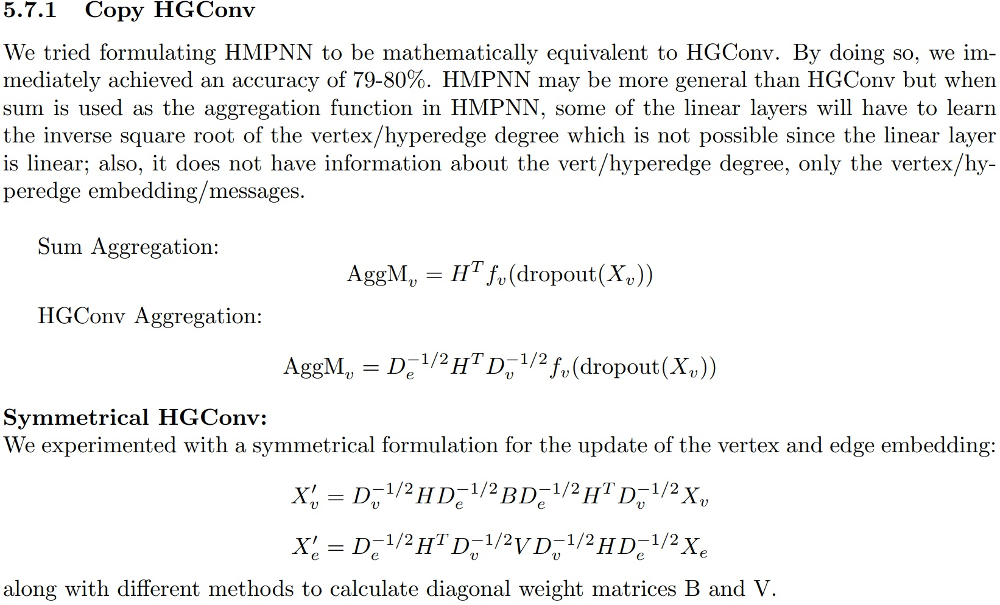

# hypergraph

[Hypergraph Neural Networks Thesis Project Report](resources/fom__down_.pdf)

My honours project on hypergraph neural networks (HGNN), a less-explored area of deep learning that ingests hypergraph data structures.
This project involves implementing hypergraph message passing neural networks(HMPNN), then experimenting, testing and analysing its performance.
I explored multiple techniques to increase the accuracy of the HMPNN, from vicreg regularisation to architectural search.
I also provided significant mathematical analysis on the results of the experimentations, where i got a grade of A+ for my contributions.

  
&nbsp;

  
  
<!--   
JEPA architecture | Hierarchial JEPA 
 -->

[1] Yifan Li, Yue Yu, Yifan Gong, Hu Wang, and Yuan Shi. Hypergraph convolution and hypergraph
attention. arXiv preprint arXiv:1901.08150, 2019.
[2] Haoyi Bai, Jianqiang Xu, and Da Huang. Message passing neural networks for hypergraphs.
arXiv preprint arXiv:2203.16995, 2022.
